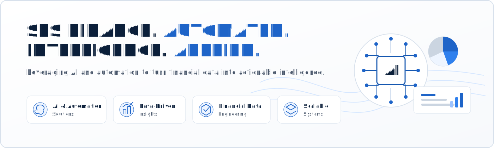
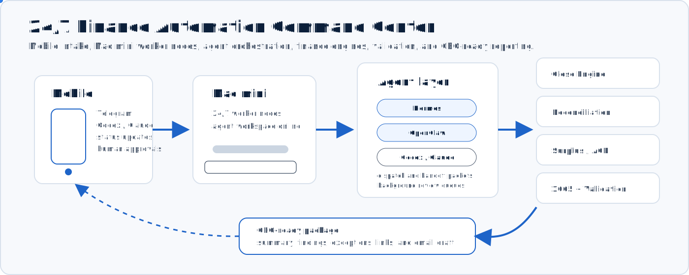

  

  
  
  
  

<table>
  <tr>
    <td width="32%" valign="top">
      

        
      

      <h2>Sophonnarith Hang</h2>
      
<strong>sophonfinance-wq</strong>

      
<strong>Tax Technology & AI Automation · Big 4 Tax Background · Founder, Sophon Finance Systems</strong>

      
Tax, finance, and accounting automation — built for reviewability, evidence, and control.

      

        <a href="mailto:sophonfinance@gmail.com">sophonfinance@gmail.com</a> 
        <a href="https://www.linkedin.com/in/sophonnarith">linkedin.com/in/sophonnarith</a>
      

      <h3>Core Capabilities</h3>
      

        
        
        
        
        
        
        
        
        
        
        
        
        
      

    </td>
    <td width="68%" valign="top">
      <h2>Hi, I'm Sophonnarith :wave:</h2>
      

        I'm a Tax Technology &amp; AI Automation builder with 18+ years of accounting and tax
        experience, including Big 4 tax work, and the founder of Sophon Finance Systems. I build
        tested, reviewable automation for tax and finance workflows, combining Python systems,
        deterministic validation, human-gated AI review, and executive-ready reporting.
      

      <ul>
        <li>Tax workpaper, reconciliation, book-to-tax, and finance reporting automation</li>
        <li>Controlled Python pipelines from source files to workpapers, evidence, and review packages</li>
        <li>Human-gated AI review workflows with deterministic validation checks</li>
        <li>Reviewer-ready outputs that preserve traceability, control, and sign-off</li>
      </ul>
      <h3>Recruiter Snapshot</h3>
      <table>
        <tr>
          <td><strong>Tax + Finance Domain Depth</strong> 18+ years across accounting, tax, reporting, reconciliations, and review workflows.</td>
          <td><strong>Tax Technology Builder</strong> Turns tax and financial data into reconciled, documented, decision-ready workpapers and summaries.</td>
        </tr>
        <tr>
          <td><strong>AI Controls Mindset</strong> Designs human-gated AI workflows with review checks, audit trails, and exception handling.</td>
          <td><strong>Controls-Focused Automator</strong> Converts manual tax and finance workflows into controlled, testable automation paths.</td>
        </tr>
      </table>
    </td>
  </tr>
</table>

## Featured Projects

| Project | What it demonstrates | Stack |
|---|---|---|
| [Sophon Finance Systems](https://github.com/sophonfinance-wq/finance-automation-portfolio) | Eight runnable finance/tax automation systems with tests, evidence, validation, and reviewer-ready reporting | Python, Excel, CI, AI controls |
| [Month-End Close Engine](https://github.com/sophonfinance-wq/finance-automation-portfolio/tree/main/monthly-close-automation) | Recurring journal entries, tie-outs, refusal controls, and close evidence | Python, pytest, JSON |
| [Cash & Debt Reconciliation](https://github.com/sophonfinance-wq/finance-automation-portfolio/tree/main/cash-reconciliation) | GL-to-bank/lender matching with materiality classification and exception reporting | Python, pandas-style logic |
| [Tax Surplus / ACB Model](https://github.com/sophonfinance-wq/finance-automation-portfolio/tree/main/tax-surplus-engine) | Traceable surplus pools, ACB ledger behavior, and distribution waterfall logic | Python, workpapers |
| [Partnership 1065 Automation](https://github.com/sophonfinance-wq/finance-automation-portfolio/tree/main/partnership-1065-automation) | Source intake, book-to-tax bridge, 1065 mapping, K-1 preview, and review checks | Python, tax workpapers |
| [Triangulate AI Validation](https://github.com/sophonfinance-wq/finance-automation-portfolio/tree/main/ai-validation-framework) | AI separation of duties: preparer, reviewer, specialist, deterministic audit, human gate | Python, AI controls |

## Tax-Tech Operating Model

  

The operating model is intentionally control-first: source files are ingested, transformed into structured workpapers, validated through deterministic checks, and summarized for human review. AI-assisted steps are used only where they improve classification, review, explanation, or exception analysis, with final judgment kept human-gated.

Public demos use synthetic data and enterprise-safe patterns: Python, Excel-compatible outputs, Markdown/JSON evidence, tests, CI, and clear reviewer notes.

## Current Focus

| Area | Direction |
|---|---|
| Tax and finance AI review workflows | Human-gated workflows that assist with review, validation, summarization, and approval routing |
| Tax and financial data engineering | Clean pipelines from source files to tax workpapers, reconciliations, review evidence, and management packages |
| Tax-control validation systems | Read-only checks for tie-outs, lineage, support, exception handling, and reviewer evidence |
| Reviewer and executive reporting | Short, clear summaries that help reviewers and leadership understand findings, exceptions, and next actions |

## GitHub Activity

| Metric | Portfolio Signal |
|---|---|
| Repositories | Tax and finance automation systems, validation engines, tax modeling demos, and workflow documentation |
| Tests | CI-backed examples that prove behavior instead of only describing it |
| Documentation | Plain-English walkthroughs for clients, recruiters, and technical reviewers |
| Data policy | Public demos use fictional, seeded sample data only |

  <a href="https://github.com/sophonfinance-wq/finance-automation-portfolio"><strong>View the full portfolio</strong></a>
  &nbsp;|&nbsp;
  <a href="mailto:sophonfinance@gmail.com"><strong>Start a conversation</strong></a>

